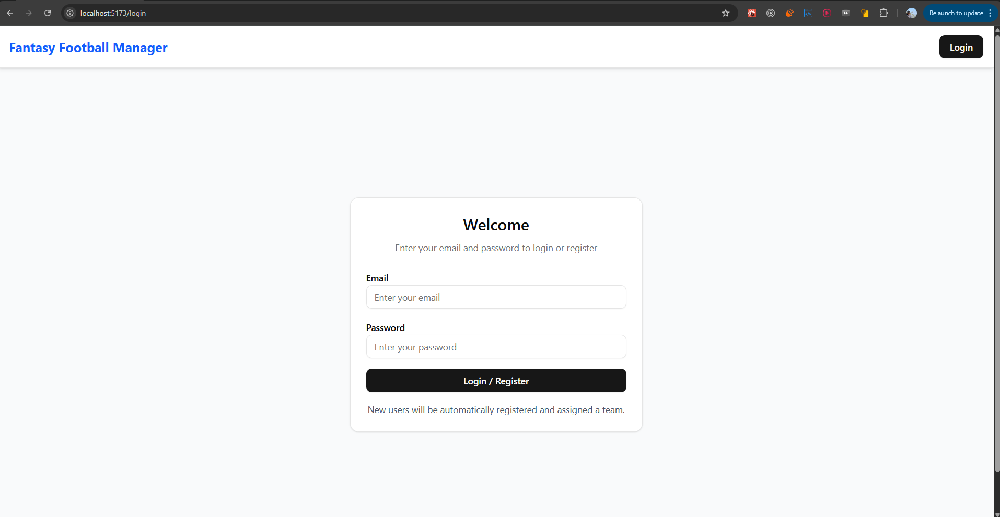

# Football Fantasy Manager UI

## Dependencies:

-  @radix-ui/react-slot — UI primitive slot utility
-  @radix-ui/react-tabs — accessible tab components
-  @tailwindcss/vite — Tailwind integration for Vite
-  class-variance-authority — utility for managing class variants
-  clsx — conditional className utility
-  lucide-react — icon library for React
-  react — core React library (v19.1.0)
-  react-dom — DOM rendering for React (v19.1.0)
-  react-router-dom — routing for React apps
-  tailwind-merge — smarter class merging for Tailwind
-  tailwindcss — Tailwind CSS framework

## Features:

-  **Single Login/Register Endpoint**
-  **Context API for State**
-  **Service Layer Pattern** - Clean separation of API logic from UI
-  **TypeScript Throughout** - Type safety
-  **Responsive Design** - Works on all device sizes
-  **Error Handling** - User-friendly error prompts

# Project UI Screens

LoginPage

DashBoard Page

Marketplace Page

Transfer(Transactions) Page

Profile Page

### Request Flow by Page

#### App Initialization (AuthContext)

-  Check localStorage for token
-  If token exists → _GET_ /api/auth/profile
-  Set user state and team status

#### LoginPage Flow

-  User enters email/password
-  **POST** /api/auth/login

-  Store token and user data

-  Redirect to /team

#### TeamPage Flow

-  Load: **GET** /api/team

-  Add to transfer list: _POST_ /api/transfer/list

-  Remove from transfer list: _DELETE_ /api/transfer/list/{playerId}

#### MarketplacePage Flow

-  Load: _GET_ /api/transfer/market (with filters)

-  Apply filters: _GET_ /api/transfer/market (with new params)

-  Buy player: _POST_ /api/transfer/buy

-  Refresh market: _GET_ /api/transfer/market

#### ProfilePage Flow

-  Load: _GET_ /api/auth/profile (user info)

-  Load: _GET_ /api/team (if hasTeam is true)

#### TransferListPage Flow

-  Load transfer list: _GET_ /api/team/transfer-list

-  Load history: _GET_ /api/transfer/history

-  Remove from list: _DELETE_ /api/transfer/list/{playerId}
