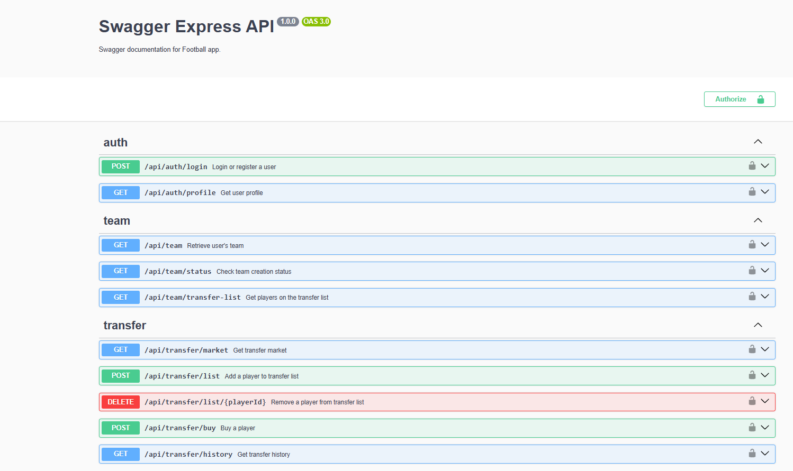
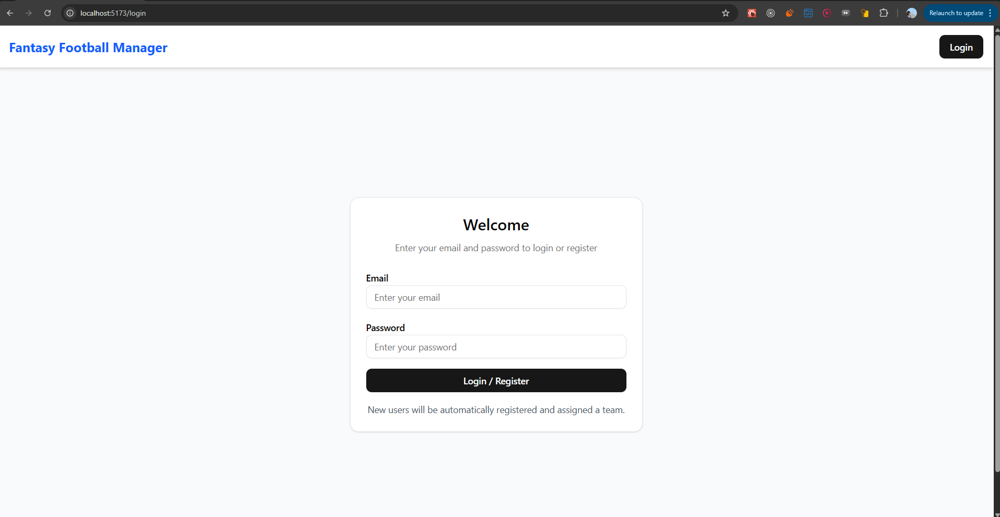
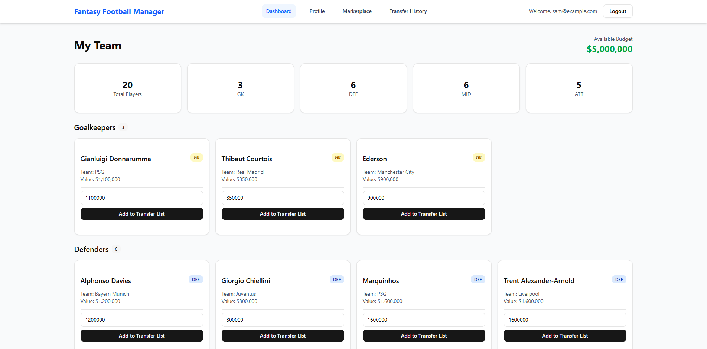
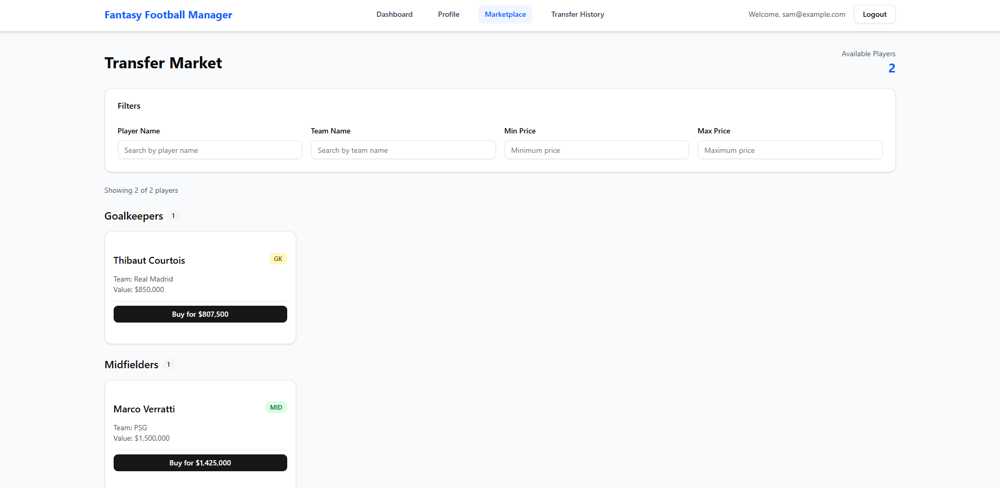
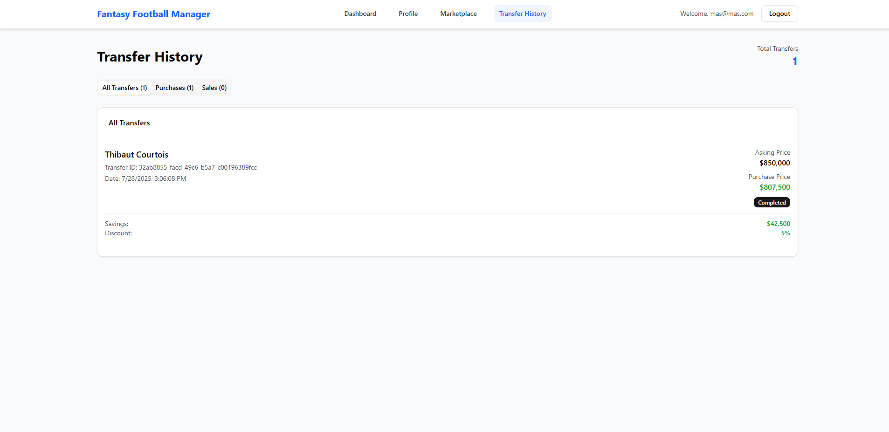
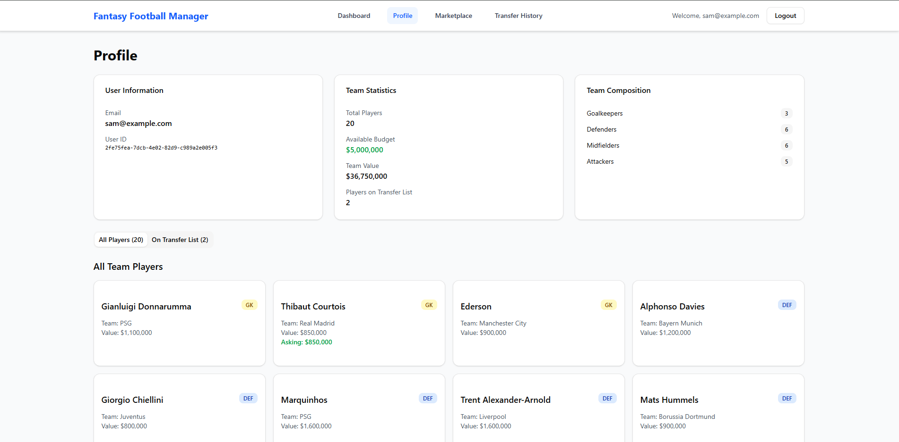

# Football Fantasy Manager Web App

---

Demo Videos:

1. 
2. 

The second video has better voice. Apologies as the laptop mic was not capturing the audio well.

The app allows users to register/login, get a team assigned, and participate in the transfer market.

### Features Added:

### Users

-  A single flow is used to handle both registration and login using email and password.

### Team Creation

-  Upon first login, a new user automatically gets a team.
-  Each team starts with a budget of $5,000,000.
-  The team includes:
   -  3 Goalkeepers
   -  6 Defenders
   -  6 Midfielders
   -  5 Attackers
-  Team creation is handled asynchronously in the background.

### Transfer Market

-  Users can:
   -  Filter available transfers by team name, player name, or price.
   -  Add/remove players to/from the transfer list and set asking price.
   -  Buy players from other teams at 95% of the asking price.
-  Teams must always have 15–25 players.

## Tech Stack

-  **Backend**: Node.js with Express
-  **Frontend**: Vite based ReactJS, TailwindCSS, ShadCN, Typescript

## Setup Instructions

1. Clone the repository.
2. Backend setup:

   -  Navigate to `/backend`
   -  Install dependencies: `npm install`
   -  Set environment variables in a `.env` file
   -  Start server: `npm run dev`

3. Frontend setup:
   -  Navigate to `/frontend`
   -  Install dependencies: `npm install`
   -  Start dev server: `npm run dev`

I will add the hosted links if possible here.

# Time Breakdown

**Project setup and planning: 2 hours**

-  Wrote all the requirements, looked into previous works and best practises, focused on backend set up first so that I am clear with response and request structures and business logic implementation, did basic set up and installed required dependencies.

---

### Backend - 20hr

**Authentication (login + register in one): 3 hours**

-  Made use of JWT library for token based login mechanism. User list is stored inmemory in the code itself. There is no environment variable set up for database url or other keys here. If not already exists, create new user logic implementation.

-  Side by side I started adding Swagger Documentation in parallel to help me test it from the Swagger UI.

-  **Swagger Image**:

**Team creation logic: 7 hours**

-  This involved complexities to store the team with a unique id, how the randomisation will work, following the business logic, I separated the work in controllers and services and started using controller for only the routing and relevant function mapping, while I used the service files for maintaining business logic.

-  It was cruicial to associate each team with it's own unique id so it is kept unique, in future if further updates are required, for a user to have multiple teams just in case.

**Transfer market logic (filtering, buying/selling): 9 hours**

-  This was the most challenging aspect of the application, as I had to use controllers only for the technical logic and separately use the service like team service to manage team operation like adding and removing players, while also keeping track of JSON data for the transactions which are happening.

-  I took my time to write the plan on paper and then code anything.

---

### Frontend: 24hrs

**Installations**

-  Fixed installation issues as ShadCN requires Node version 20 or higher.
-  Listed all backend routes and their request/response structures (using Swagger as reference) for consistency in API usage.

## Designing the Style on Paper : 1.5-2hr

-  Made boilerplate adjustments in the code and implemented authentication logic using context for global state management.
-  Built relevant UI components, starting with a simple profile page, then moving on to team and then marketplace and tansferss.
-  Continued refining the layout as the design took shape.

## Connecting Frontend to Backend: 7 hours

-  Integrated API calls with the provided endpoints.
-  Ensured that user authentication, data fetching, and error handling were correctly wired between frontend and backend.

## Debugging and Testing

-  Performed debugging during development by adding console.log statements to trace API responses and fixing inconsistency in cloned users.
-  Tested individual UI components and overall page flows to verify feature functionality.

## Documentation and Cleanup: 1 hour

-  Updated the README with setup and usage instructions.
-  Performed code cleanup and added developer comments for clarity.

# Project UI Screens

